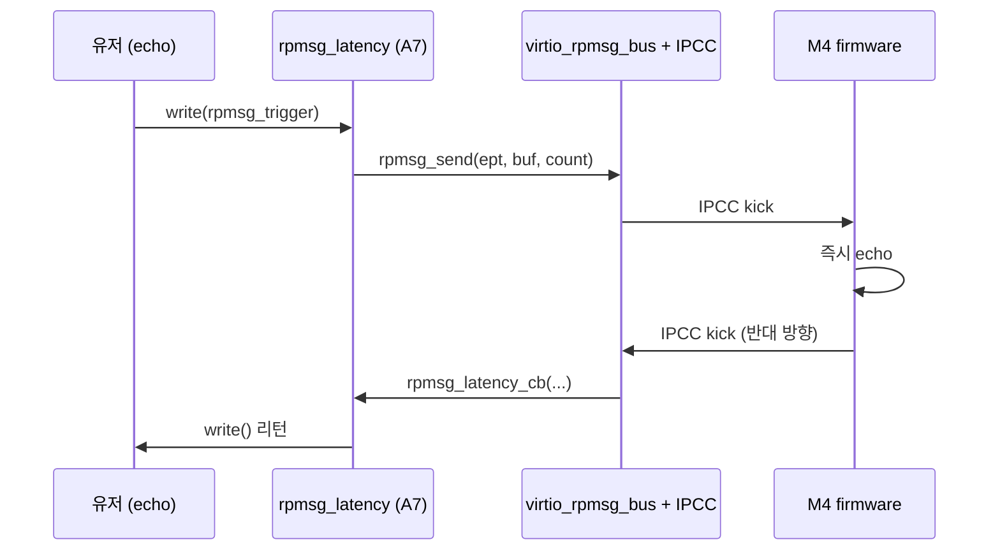

[1편]()에서 ST 공식 예제로
A7↔M4 RPMsg 왕복을 확인했다. 이번 편의 목표는 그 채널을 **직접 작성한 커널 드라이버**로
바꾸고, 왕복 지연을 실측하는 것 — Lv4 원 계획의 P4다.

## 설계 — 아는 도구로, 필요한 만큼만

새 서비스 `"rpmsg-latency"`를 M4/커널 양쪽에 새로 만들기로 했다. 몇 가지 선택:

- **블로킹 단발 프로토콜**: 논블로킹+seq번호 매칭 대신, 하나 보내고 응답 올 때까지
  대기하는 구조를 택했다. 한 번에 요청이 하나만 나가있으면 "다음 콜백 = 방금 보낸
  요청의 응답"이 자명해져서 매칭 로직 자체가 필요 없어진다.
- **waitqueue**: Lv2 `kim-spi.c`에서 이미 써본 `wait_queue_head_t` +
  `wait_event_interruptible`/`wake_up_interruptible` 패턴을 재사용했다. `struct
  completion`이 "1회성 이벤트 대기"엔 더 전용 도구지만, 아는 도구로 먼저 갔다.
- **sysfs attribute**: 캐릭터 디바이스(`file_operations` 풀세트) 대신
  `DEVICE_ATTR_WO`+`device_create_file`. "echo 하면 왕복 1회 트리거" 하나만 필요한데
  open/close/다중 인스턴스까지 만들 이유가 없었다.

```c
static ssize_t rpmsg_trigger_store(struct device *dev, struct device_attribute *attr,
                                    const char *buf, size_t count)
{
	struct rpmsg_latency_status *l_status = dev_get_drvdata(dev);

	l_status->flag = 0;
	int ret = rpmsg_send(l_status->rpdev->ept, (void *)buf, count);
	if (ret < 0)
		return ret;

	wait_event_interruptible(l_status->wq, l_status->flag);
	return count;
}
```

## 디버깅 — `rpmsg_tty.c`를 복붙해서 걷어내다가 겪은 것들

기존 `rpmsg_tty.c`를 참고하며 하나씩 우리 설계에 맞게 고쳐나갔다. 실제로 겪은 것 중
가장 오래 남아있던 버그는 이거였다 — 콜백에서 `wake_up_interruptible()`만 부르고
`l_status->flag = 1`을 빼먹은 것. `wait_event_interruptible`은 깨어나도 조건을 다시
검사하기 때문에, 플래그 없이 깨우기만 하면 다시 잠들어버린다. 두 번 지적받고서야 반영됐다.
그 외에 `kzalloc` 실패를 `IS_ERR()`로 검사하던 것(`kzalloc`은 `NULL`을 반환하지 에러
포인터가 아니다 — `PTR_ERR(NULL)`은 0이라 실패가 성공처럼 보이는 조용한 버그였다),
`DEVICE_ATTR_WO(name)`이 `<name>_store` 함수명을 토큰 붙이기로 글자 그대로 찾는다는
걸 몰라서 이름이 안 맞았던 것 등도 있었다.

## 크로스빌드 여정 — Yocto 내부 디렉토리를 직접 참조한 대가

정상 경로(SDK `populate_sdk` 또는 자체 메타레이어)를 안 타고, `tmp-glibc/
sysroots-components` 같은 bitbake 내부 구현 디렉토리를 직접 참조하는 "빠른 반복"
우회로로 갔다. 그 대가로 여섯 가지를 손으로 다 부딪혀 알아내야 했다:

1. 최근 Yocto는 커널 소스(`kernel-source`)와 빌드 산출물(`kernel-build-artifacts`)이
   분리돼 있어서 `KDIR`/`KOUT` 둘 다 넘겨야 한다.
2. `CROSS_COMPILE` prefix가 표준(`arm-linux-gnueabihf-`)이 아니라 ST 전용
   (`arm-ostl-linux-gnueabi-`)이다.
3. gcc가 내부적으로 부르는 `as`가 PATH에 크로스 툴체인이 없으면 시스템 기본(x86_64)
   `as`를 잘못 집는다 — `as: unrecognized option '-EL'`(ARM 리틀엔디안 옵션을 x86 `as`가
   거부).
4. `gcc-cross-arm`과 `binutils-cross-arm`이 별개 패키지라 `as`/`ld`가 다른 디렉토리에 있다.
5. `gcc -print-prog-name=as`로 확인해보니 gcc가 내부적으로 찾는 이름은 접두사 없는
   그냥 `as`다 — 접두사 붙은 이름만 있는 디렉토리를 PATH에 넣는 것만으론 부족해서,
   `~/cross-bin/as`, `~/cross-bin/ld`라는 접두사 없는 심볼릭 링크를 만들어 PATH 최우선에 뒀다.
6. 커널 빌드시스템은 `LD`를 PATH 탐색이 아니라 `$(CROSS_COMPILE)ld`로 직접 계산해서
   실행한다 — `gcc-cross-arm` 폴더엔 `ld`가 없어서 존재하지 않는 경로가 됐다. `LD=`를
   `binutils-cross-arm` 쪽 실제 경로로 명시적으로 override해서 해결.

빌드 성공 후 `insmod` → probe 바인딩까지 실물로 확인했다:

```
$ ls -al /sys/bus/rpmsg/devices/virtio0.rpmsg-latency.-1.1026/
--w------- 1 root root 4096 rpmsg_trigger
```

## 왕복 지연 실측 — bpftrace가 없어서 ftrace로

원 계획은 Lv2 P6과 같은 방법(bpftrace로 kprobe/kretprobe 델타)이었는데, **보드 이미지에
bpftrace 자체가 없었다.** ftrace의 `function_graph` tracer도 시도했지만
`available_tracers`가 `nop` 하나뿐 — lockdown이 아니라(`/sys/kernel/security/lockdown`
파일 자체가 없어서 확인·배제), 그냥 프로덕션 지향 defconfig에 안 컴파일돼 있던 것이다.

다음 대안인 **동적 kprobe 이벤트**(`kprobe_events`, `CONFIG_KPROBE_EVENTS`)는 살아있었다
— function tracer보다 훨씬 가벼운 별개 서브시스템이라 프로덕션 커널에도 종종 남는다.

```bash
echo 'p:rpmsg_start rpmsg_trigger_store' >> /sys/kernel/debug/tracing/kprobe_events
echo 'p:rpmsg_end rpmsg_latency_cb'      >> /sys/kernel/debug/tracing/kprobe_events
echo 1 > /sys/kernel/debug/tracing/tracing_on
for i in $(seq 1 50); do echo hi > .../rpmsg_trigger; done
```

블로킹 단발 설계 덕분에 `rpmsg_start`/`rpmsg_end`가 항상 번갈아 찍혀서, 순서대로 짝지어
타임스탬프 델타만 계산하면 됐다.

## 결과 (50샘플)

| 항목 | 값 |
|---|---|
| 중앙값 | 147.0 µs |
| 최소 | 139.0 µs |
| **정상구간 평균**(이상치 2건 제외) | **148.2 µs** |
| 정상구간 범위 | 139.0 ~ 174.0 µs |

50개 중 2건(215µs, 435µs)만 콜드스타트성으로 튀고 나머지 48개는 139~174µs로 촘촘했다.
전체 경로는 이렇게 생겼다:



**A7↔M4 RPMsg 왕복 정상구간 지연 약 148µs.** 다음 편은 이 인프라 위에 진짜 유스케이스
(M4가 ADC를 자율 샘플링)를 얹고, 리눅스에 부하를 걸어도 M4 쪽 타이밍이 흔들리지
않는지 — Lv4의 진짜 핵심 주장을 실측하는 이야기다.
